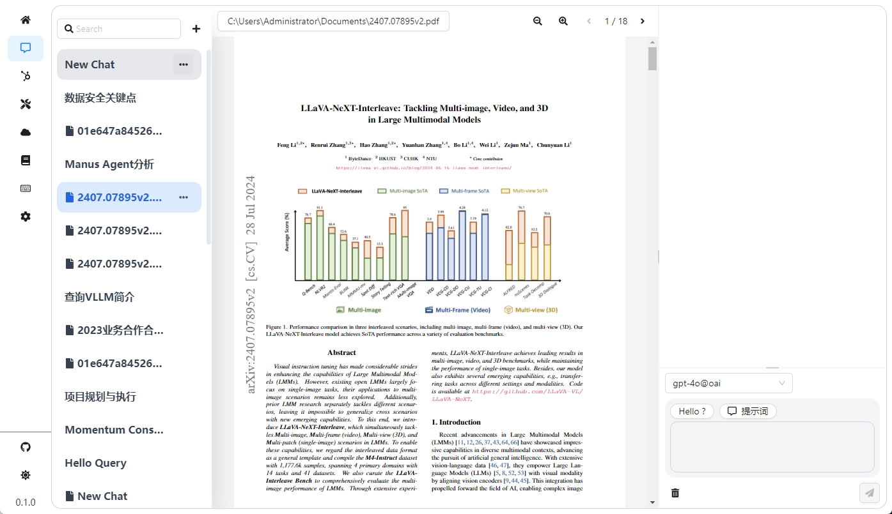
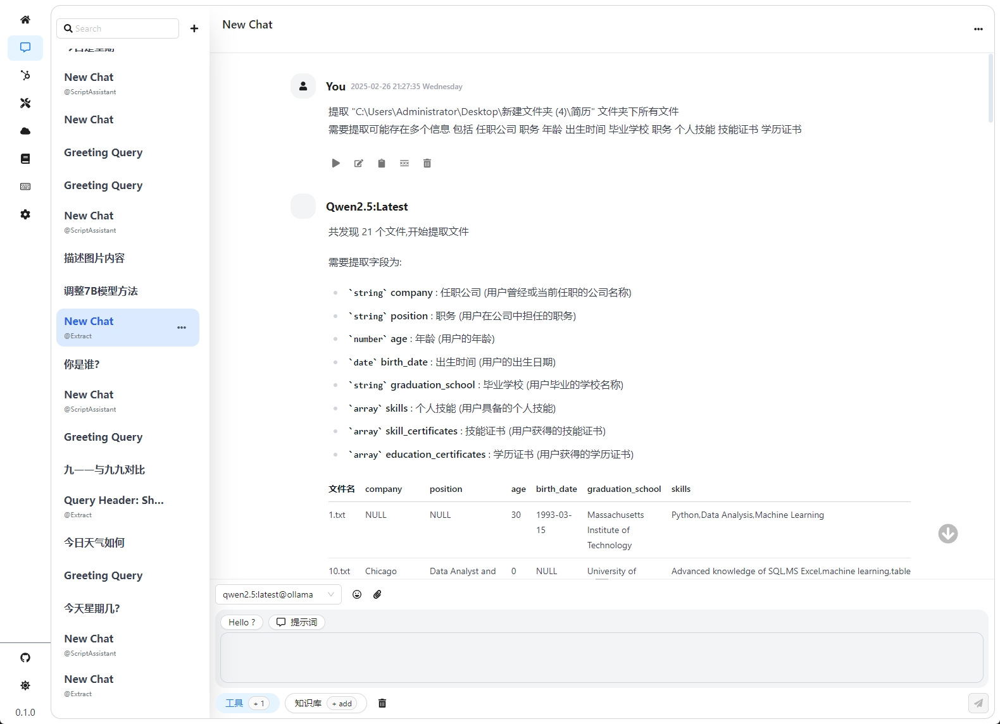
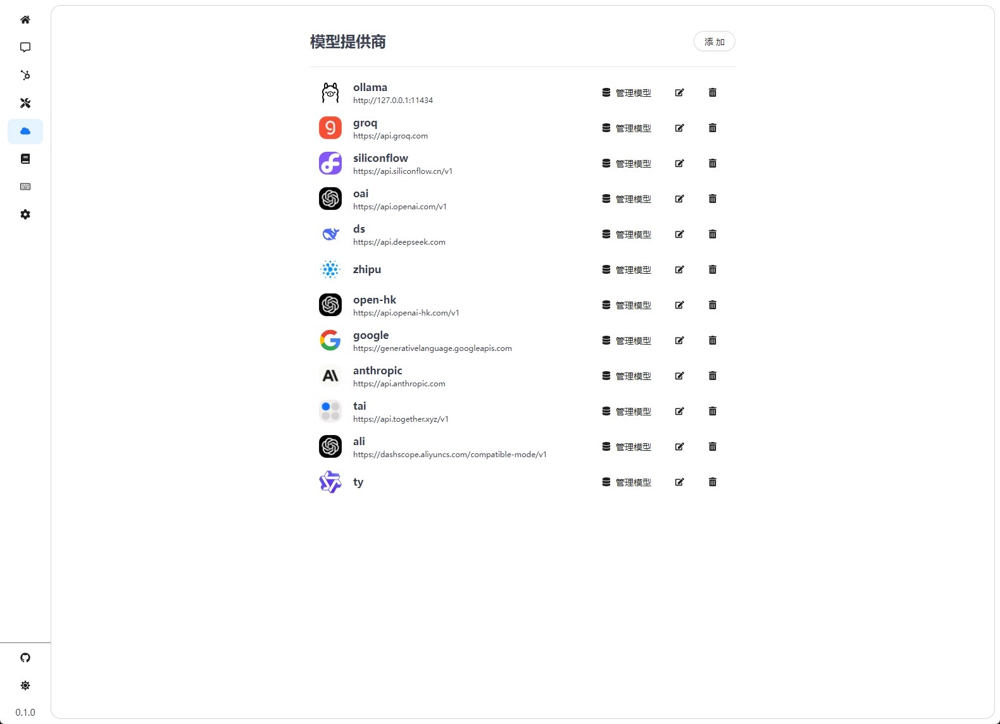
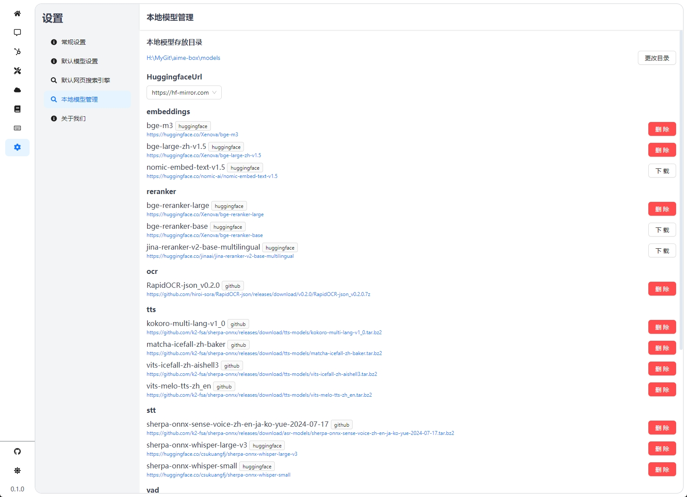

# Aime Box


### 一款基于 langchain + electron开发的多平台桌面端 Chat 客户端
支持本地知识库，tool调用，多个智能agent调用

目标尽量实现全离线本地可执行的之智能agent

### 🖼 **截图**





### 开始
1. 添加模型提供商(如Ollama)
2. 点击管理模型(启用需要的模型)
3. 聊天页面即可对话聊天
4. 下载一些本地模型 设置-本地模型管理(如国内调整HuggingfaceUrl为hf-mirror)
- 推介下载
  - bge-m3 用于知识库检索
  - bge-reranker-large 用于知识库重排序
  - RapidOCR-json_v0.2.0 用于win环境写的ocr
  - matcha-icefall-zh-baker 用于语音生成
  - sherpa-onnx-sense-voice-zh-en-ja-ko-yue-2024-07-17 用于语音识别
  - silero_vad 用于分离说话场景
  - sherpa-onnx-pyannote-segmentation-3-0、3dspeaker_speech_eres2net_base_sv_zh-cn_3dspeaker_16k 用于说话人识别
  - rmbg-1.4 用于背景消除

### 🌟 **特点**
- 多个模型供应商支持 ollama、openai、deepseek、anthropic等等
- 多种工具调用支持 webloader、websearch、stt、tts、ocr等等
- 本地知识库引擎，使用lancedb 进行本地知识库检索，支持image、docx、doc、text、url做为输入源
- 多agent，目前有数据提取agent、代码助手、翻译助手
- 提示词保存功能
  

### 📝 **Todo**
- [ ] mac平台兼容
- [ ] 多语言支持
- [ ] 文档对话功能类似于ChatDoc 支持docx、pdf、txt、url、mp4、音频文件等格式的对话
- [ ] 浏览器browser-use
- [ ] Tool自动创建工具，输入url或说明文档自动创建工具供模型调用
- [ ] 更多的agents

### Agent
1. `Extract` 数据提取助手，用于对指定文件或文件夹下所有文件进行检索，根据用户给出的字段进行全文或部分抽取，markdown格式输出
2. `ScriptAssistant` 对用户的任务生成一个python脚本和venv环境执行

### 🔌 **技术栈**
感谢以下开源项目的支持
- [electron-react-boilerplate](https://github.com/electron-react-boilerplate/electron-react-boilerplate) 用于electron开发的react框架模板
- [langchainjs](https://github.com/langchain-ai/langchainjs) agent框架
- [lancedb](https://lancedb.github.io/lancedb/) 本地向量知识库
- [sherpa-onnx](https://github.com/k2-fsa/sherpa-onnx) 语音识别和语音合成等
- [@huggingface/transformers](https://github.com/huggingface/transformers) 本地运行onnx模型库

如有缺漏请联系作者补充


### 🐞 **Dev**
```sh
npm install
npm run start
```

### 💼 **Build**
```sh
# window
npm run package
```

### 🌐 **About**
author: 781172480@qq.com


## License

This project is licensed under the Apache License 2.0. See the [LICENSE](LICENSE) file for details.

© [Aime Box](https://github.com/AimeBox/aime-box.git)

